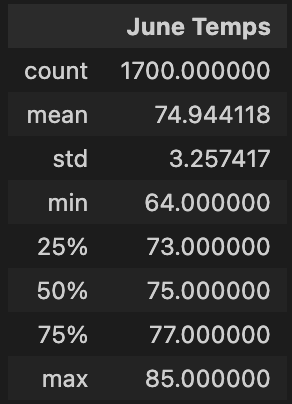
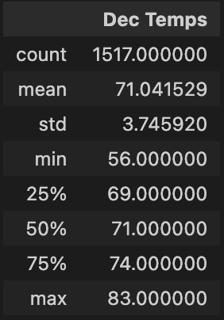

# Surf's Up Surf 'n Shake Shop Analysis

## Overview

W. Avy is considering investing in a new Surf 'n Shake shop to open in Hawaii on the island of Oahu.  While the initial analysis of the idea looks promising, before commiting to invest, he'd like more information about temperature trends to ensure that the shop will be sustainable year-round. 

The below analysis was developed in response to W. Avy's request and to assist in decision making.

## Results
We have access to a database with a variety of weather-related measurements from January 2010 through August 2017. From this database, we created queries to pull all temperatures observed in the months of June and December and then ran statistical analyses on those data sets.

We can see below the restuls of the statistical analysis on temperatures in the months of June and December, respectively:

From these results, we observe the following:

1. Both months have a similar number of observations, and enough observations from which we can draw conclusions.

2. The mean temperature in December is only 3 degrees lower than June, and it still a good temperature for surfing and ice cream.

3. The historical temperatures between the first and third quartile, even in December, are still quite nice, ranging between 69 and 83.

## Summary

While the temperature statistics do look promising and are one helpful insight for W. Avey to consider, I recommend pulling the additional statistics below:

1. Pull all temperature observations for all months, and preform the same statistical analysis on each month.  W. Avy has made an assumption that December is the only 'cold' month he needs to be concerned about, but expanding the analysis to look across the entire year would be helpful.

2. Pull all precicitation observations for all months, and perform the statistical analysis on the precipitation data.  

Temperatures are only one indicator of whether people will come to the Surf 'n Shake shop in a given month.  Combining the temperature and precipitation metrics together would provide a more holistic capability to predict the success of the shop.

